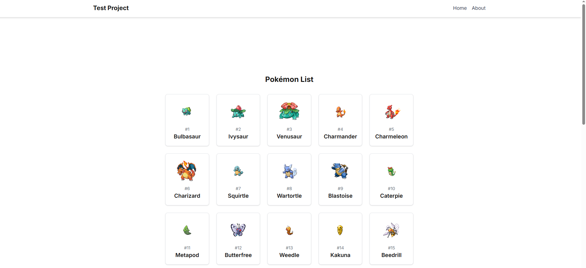
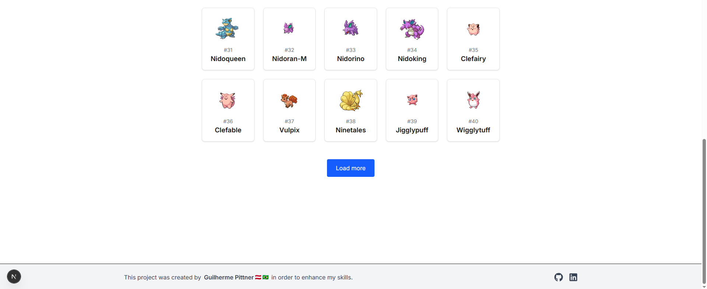
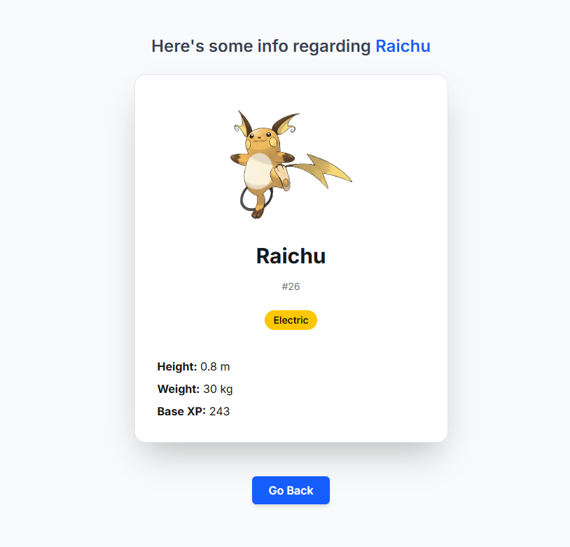

# test pokedex

## I started learning NEXTJS with Matheus Battisti [introduction course](https://www.youtube.com/playlist?list=PLnDvRpP8BnezfJcfiClWskFOLODeqI_Ft) and at the end of the classes he proposes a challenge. I decided to try and built this test pokedex.

## Screenshots 📸
Here's a screenshot and [a link](https://tic-tac-toe-react-hazel-seven.vercel.app/) to check the project yourself.

#

#

